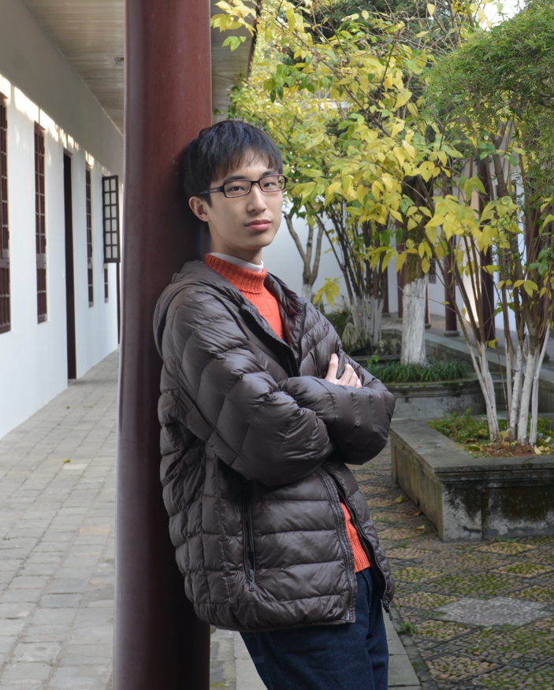

## About Me

 Here is **Siyuan He** (贺思远). 

 I am a 5th-year PhD student at Purdue University, where I am advised by [Tiark Rompf](https://tiarkrompf.github.io/).

 My primary research interest is programming languages, especially type systems. I am also interested in formal verification, logics, and semantics. 

 I am open to academic discussions and potential collaborations. Please feel free to reach out to me at **he662 [at] purdue.edu**, and I strongly suggest cc-ing **hesy [at] umich.edu** due to the spam policy.

 I will be on the market soon, and looking for job and academic opportunities.

---

## Primary Research Interests

- Functional Programming Languages, General-Purpose Languages
- System F-sub variants, System F-omega-sub, System D-Sub, Calculus of Construction
- Reachability Types, Alias Tracking
- Region-Based Resource Management, Stack Disciplines
- Flow-Sensitive/Insensitive Effects, Effect Polymorphism
- Logical Relations, Semantic Type Soundness.

---

## Other Research Interests

- Formal Verification: General Coq proofs, VST
- Type Theory, Category Theory, HoTT

---

## News and Updates

- **Fall 2025**：Graduate Teaching Award (for CS240)